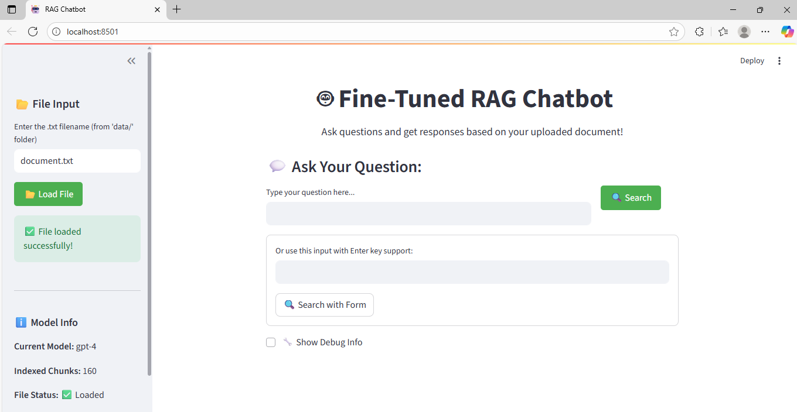
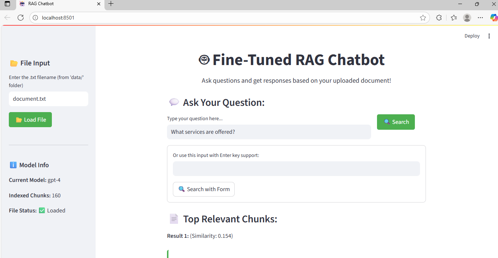
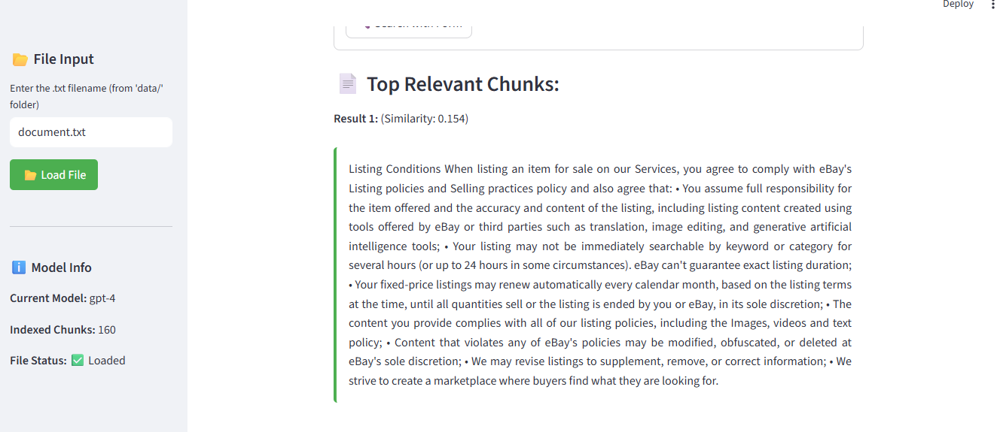
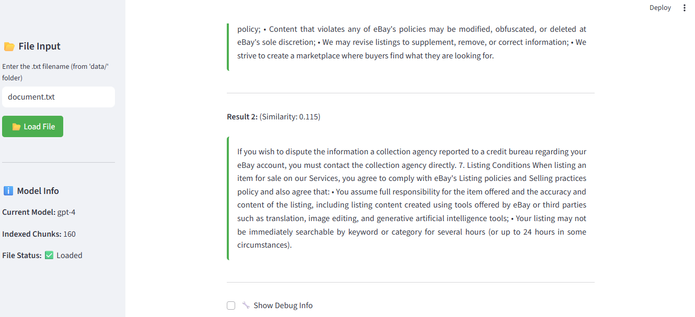
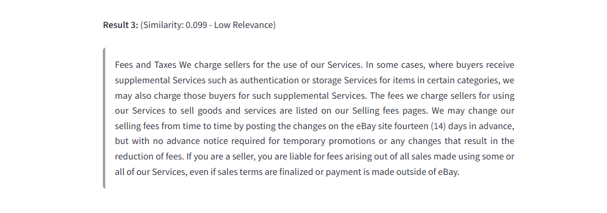

# 🤖 Fine-Tuned RAG Chatbot with Streaming Responses

This project is a **Retrieval-Augmented Generation (RAG)** based chatbot developed as part of the **Amlgo Labs Junior AI Engineer Assignment**. It allows users to ask questions based on a `.txt` document and returns the most relevant answers using vector search and LLMs.

---
## 📌 Project Architecture and Flow

This project implements a Retrieval-Augmented Generation (RAG) Chatbot that allows users to query custom documents using an LLM (Large Language Model) with contextual awareness.
1. Data Ingestion & Preprocessing

    Input: Any set of documents (PDF, TXT, DOCX, etc.).

    Processing:

        Load documents into memory.

        Split large text into smaller chunks for better retrieval performance.

        Clean and normalize text (remove special characters, extra spaces, etc.).

2. Embedding Creation

    Each chunk of text is converted into dense vector embeddings using a pre-trained embedding model (text-embedding-3-small / text-embedding-3-large from OpenAI).

    These embeddings represent the semantic meaning of text, enabling similarity-based search.

3. Vector Store Indexing

    Embeddings are stored in a vector database (e.g., FAISS).

    This allows for fast similarity search to retrieve the most relevant chunks for any query.

4. Retrieval-Augmented Generation (RAG) Pipeline

    Query Processing:

        User inputs a query.

        The system converts the query into embeddings and searches the vector database.

    Contextual Retrieval:

        The top k most relevant chunks are retrieved.

    Response Generation:

        Retrieved context is passed to the LLM (e.g., GPT-4 / GPT-3.5) along with the user query.

        The model generates a contextual, accurate, and fluent answer.

5. Streaming Response

    The chatbot supports streaming output, meaning responses are displayed in real-time as the model generates them.

    


## 📁 Project Structure

├── app.py # Streamlit app for chatbot interface
├── requirements.txt # All dependencies
├── .venv/ # Virtual environment
├── chunks/ # Contains chunked text data
├── data/ # Input .txt files
├── db/ # Local DB or cache storage
├── vector_db/
│ ├── faiss_index/
│ ├── index.faiss
│ └── index.pkl
├── src/ # Source modules
│ ├── document_processor.py # Handles reading & chunking documents
│ ├── embedder.py # Embeds chunks using Sentence Transformers
│ ├── retriever.py # Retrieves top-k relevant chunks
│ ├── generator.py # Generates final response using LLM
│ ├── prompt_formator.py # Formats the prompt for generation
│ ├── vector_store.py # FAISS vector DB store handler
├── 01_chunk_text.ipynb # Step 1: Load & chunk text
├── 02_embed_store.ipynb # Step 2: Embed chunks & store in vector DB
├── 03_test_prompt.ipynb # Step 3: Test prompt output manually


---

## 🚀 Installation & Setup

1. **Clone the repository**  
   ```bash
   git clone https://github.com/yourusername/rag-chatbot.git
   cd rag-chatbot

2. **Create virtual environment (.venv)**

    Done via VS Code using Python environment creation
    Alternatively:
    python -m venv .venv
    source .venv/bin/activate       # Linux/macOS
    .venv\Scripts\activate          # Windows

3. **Install all requirements**
    pip install -r requirements.txt

4. **Set your OpenAI API key (Required for GPT responses)**
    Create a file called .streamlit/secrets.toml in the project root with:
    OPENAI_API_KEY = "your_openai_api_key_here"
---

⚙️reprocessing Flow
🧾 Step 1 – Chunk the Text

Run 01_chunk_text.ipynb to:

    Read the .txt file from the /data folder

    Chunk the text using document_processor.py

    Save the chunks to /chunks

🔗 Step 2 – Embed and Store

Run 02_embed_store.ipynb to:

    Load chunks from /chunks

    Embed using SentenceTransformer (e.g., all-MiniLM-L6-v2)

    Store in FAISS vector DB under /vector_db/faiss_index

📤 Step 3 – Test Prompt

Run 03_test_prompt.ipynb to:

    Retrieve top-k chunks

    Format prompt using prompt_formator.py

    Generate a response using the chosen LLM


💬 Launch the Chatbot UI
    Run the Streamlit app:
    streamlit run app.py

---

## Features:

    Enter a .txt filename (like document.txt) from the /data folder

    Ask a question based on that document

    Returns the top 3 relevant chunks with semantic similarity

    Clean UI with LLM-ready formatting

🧠 Models & Tools Used

    Embedding Model: all-MiniLM-L6-v2 (via Sentence Transformers)

    Vector DB: FAISS for similarity search

    Prompt Formatting: Custom logic in prompt_formator.py

    LLM: (can be OpenAI, HuggingFace, or any local model)

    Frontend: Streamlit


📌 Example Query

🗂 Document: document.txt
❓ Query: "What is this document about?"
✅ Returns: Top 3 relevant chunks from the document that match the query using cosine similarity.


🏁 Final Notes

    Ensure .txt files are placed in the /data folder.

    If you rerun chunking/embedding, older data will be overwritten in /chunks and /vector_db.

    App is kept lightweight, modular, and readable for further improvements.


## 📸 Screenshots

### Main Page


### Example Results






## 📹 Chatbot Demo
[Watch the Chatbot Streaming Demo](assets/RAG_chatbot.mp4)


🙋‍♂️ Developer

Pratham Verma
📧 LinkedIn- [text](https://www.linkedin.com/in/prathampvv/)
🎓 BTech CSE, VIT Vellore
🧠 AI/ML + Backend + Data Science

---


